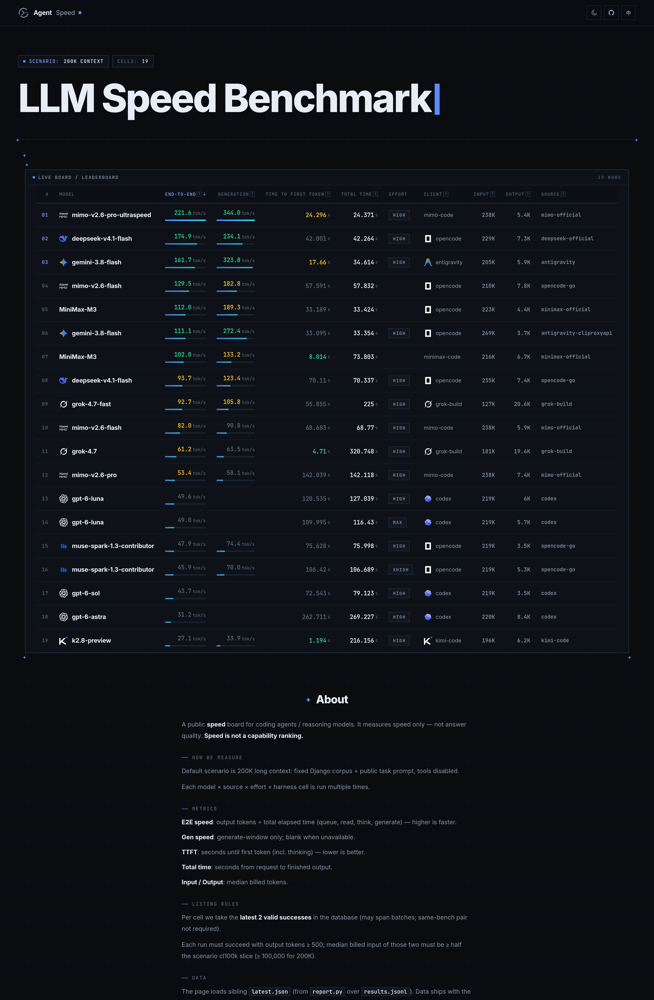

# agent_speed：Coding Agent 与推理模型真实速度基准

**公开榜单**：https://agent-speed.ooll.lol



### 微信交流群


扫码加入微信交流群（二维码有时效，过期会更换）。

主流 coding agent 与推理模型在真实长负载下的速度基准评测系统。测量不同模型、API 来源（source）、运行框架（harness）与思考强度（effort）在 200K 超长上下文下的首字延迟（TTFT，含思考）与解码吞吐（端到端 TPS 与生成 TPS）。

> **说明**：本项目评测的是生成速度与吞吐，**速度不是能力排名**，不评估模型回答质量。

## 许可证

- 本项目代码遵循 [GNU Affero General Public License v3.0 (AGPL-3.0)](LICENSE)。
- `fixtures/` 下收录的 Django 评测切片遵循 Django 的 [3-Clause BSD License](fixtures/LICENSE.django)，版权归 Django Software Foundation 及其贡献者所有。

## 评测语料与任务

- **语料基准**：选用 `django/django` 官方源码仓库，固定 pin tag `6.1.1`（commit `249b13d6e93ee3164dee8ed1775395622a50c337`）。
- **切片规则**：仅纳入源码（`django/`）与文档（`docs/`），彻底排除全部测试（`tests/`、`js_tests/`、测试单文件）、数据迁移（`migrations/`）、翻译文件（`locale/`）、构建配置及媒体资产。按文件路径正序排列，产出 10K / 100K / 200K 三档严格嵌套的切片（10K 是 100K 字节前缀，100K 是 200K 字节前缀）。
- **评测任务**：任务文本（`prompts/task_200k.md`）全文公开，要求对 200K 切片从系统分层、模块职责、数据流转、技术选型四个维度展开中文架构剖析。严禁调用任何工具，严禁读写本地文件，严禁执行命令。

## 调度机制与指标口径

### 队列调度

- **物理队列隔离**：按物理服务配额划分独立队列 `queue`（例如 DeepSeek 官方直连与 OpenCode-Go 网关分流，Gemini 多渠道共享配额同队）。
- **双层受控并发**：单队列最多 **2 并发**（防止单账号/单端点排队争抢与限流抖动）；全系统设置 **10 并发** 物理上限。
- **3+1 Batch 机制**：每个格子（场景 × 模型 × effort × source × harness）跑 3 次调用，分配唯一样本批次 `batch_id`；若某次调用失败，在该队列末尾追加 1 次补测。无单独 warmup 轮次。

### 指标口径

- **wall**：进程启动至退出的端到端总时间（秒）。
- **TTFT**：首个可见 token（含思考推理与正文）的到达时刻（秒）。
- **生成时间窗（generation window）**：模型进入正文生成阶段的真实时间窗（秒，不含预填延迟）：
    - `opencode`：文本段服务端时间窗（`text` part 的 `time.start` 到 `time.end`）。
    - `grok-build`：最后一条内容增量到达时刻减去 TTFT。
    - `kimi-code`：session 落盘的 `llmServerDecodeMs`。
    - `codex`：事件流无生成时间戳，字段为空（None）。
    - `antigravity`：最后一条内容增量（`text_delta`）到达时刻减去 TTFT。
- **两个 TPS**：
    - **端到端 TPS** = `输出 token ÷ wall`（全流程吞吐；在 200K 场景下受预填固定时间摊薄影响，与模型输出 token 数量呈强正相关）。
    - **生成 TPS** = `输出 token ÷ 生成时间窗`（纯流式生成吞吐；剔除了超长输入的预填耗时稀释，是衡量底层物理生成速度的核心指标）。无生成时间窗时为空。

## 数据产物

- **`data/results.jsonl`**：原始调用明细账本。每次调用追加一行，包含完整的 timing、token usage、队列键与批次 ID；绝不保存模型回答正文，不泄露任何本地私有路径与凭据。
- **`data/latest.json`**：上站聚合汇总表。仅读取最新一个 `batch_id`，严格执行上站门槛（最新 batch 有效次数 ≥ 2、账单输入 token ≥ 切片 cl100k 的一半、单次输出 token ≥ 500）；各项中位数仅由有效次数聚合计算，按端到端 TPS 降序输出。

## 快速上手

### 1. 安装依赖与环境

本项目推荐使用 `uv` 或系统 Python 环境：

```bash
uv tool install --upgrade --with tiktoken pytest
```

### 2. 构建评测语料

从 GitHub 克隆并构建 django 6.1.1 的有序切片与 manifest：

```bash
python3 scripts/build_django_corpus.py
```

### 3. 运行基准测速

按 source+harness 自动分队列并发执行评测并实时写入 `data/results.jsonl`：

```bash
# 全矩阵运行
python3 scripts/run_bench.py

# 过滤指定 harness 或模型
python3 scripts/run_bench.py --harnesses opencode --models cpa/gemini-3.8-flash
```

### 4. 生成上站汇总报告

由 `data/results.jsonl` 重新生成 `data/latest.json`：

```bash
python3 report.py
```

### 5. 运行测试套件

执行项目契约与自动化测试：

```bash
pytest .repo_template/tests -q -m contract
pytest tests -v
```

## 维护与运维指南

- **日常操作指南**：单模型增量重测、新模型热插拔接入、白名单过滤参数组合与故障排查详见 [`docs/guides/benchmark_operations.md`](docs/guides/benchmark_operations.md)。
- **核心契约规范**：
    - 语料切片规范：[`docs/specs/corpus_django_200k.md`](docs/specs/corpus_django_200k.md)
    - 调度采集规范：[`docs/specs/collector_scheduler.md`](docs/specs/collector_scheduler.md)
    - 上站报告规范：[`docs/specs/latest_json_report.md`](docs/specs/latest_json_report.md)
    - 公开仓库规范：[`docs/specs/public_repo_release.md`](docs/specs/public_repo_release.md)

## 公开榜单网站

- **线上地址**：https://agent-speed.ooll.lol
- **README 预览图**：`docs/board-preview-dark.png`（`report.py` / `run_bench.py` 更新 `data/latest.json` 后会尽量自动重截；也可手动 `python3 scripts/screenshot_board.py`）
- **微信交流群二维码**：`docs/wechat-group-qr.png`（与 `latest.json` 一并复制到 great_websites 的 `systems/agent_speed/web/`）
- 本仓库只负责评测与数据（`data/results.jsonl`、`data/latest.json`）。**静态公开榜单不在本仓**：站点与 Cloudflare Pages 部署维护在 [`TuTouPower/great_websites`](https://github.com/TuTouPower/great_websites) 的 `systems/agent_speed/web/`。

刷新上站数据后，将本仓 `data/latest.json` 复制到 great_websites 对应目录并按其 README 部署（或运行那边的 `scripts/deploy_pages.sh`）。
